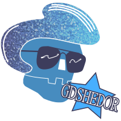
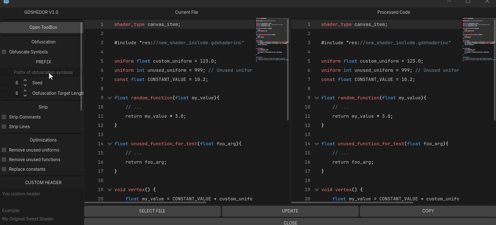

# GDShedor

Plugin for Godot

This plugin helps you improve the intellectual property of your godot shader work by adding another layer of security to the source code and usable for any type of Godot project without language in-built limitations.

Downloadable in [Releases](https://github.com/CodeNameTwister/GDShedor/releases)

>*The logo was inspired by internet creativity and using Inkscape for end it (not included as image in the release addon)*

## Preview

## Why use?
* When by default you export your Godot project, the pck file may be exposed to decompilation tools, and now your shaders may become obfuscated.
* Text obfuscation is commonly used to share shaders outside of Godot, which makes replication a bit more difficult.
* You can combine it with other tools or create more easy your own chunk loader, that is better than expose an intermediate code in the disk.
* It allows you to make your shader with inclusions in a single file to share without change the original code.

## Main Features
* Source Obfuscation.
* Customize obfuscation parameters (include for uniforms)
* Strip comment and lines.
* Auto obfuscation on export.
* Embed includes.
  
## Aditional Information
* Licensed.
* No telemetry.
* No AI work.

### Godot Version
Godot 4.6 (Tested)

## Operating system
* Windows x64
* Linux 64

## How Install
Download and put the addon folder to root in you project "res://addons"
Enable the plugins in project settings / plugins
In the left dock, now you can see the tab of GDShedor.
For more details about the components, please refer to the manual.

## About this work
This plugin was created with great dedication and care. It's part of a suite of tools I've been developing for personal use, originally since the COVID-19 pandemic.

If you are one of those who have taken the time to help me find bugs or to continually suggest new features, I want you to know that I appreciate it.

Any other tools I already relase or will release can be found on my GitHub.

Aviable for Godot 3?

I originally worked with a focus on Godot 3.2, but the current versions focus on the last stables updates of Godot 4, although they are not limited to it, so there is a possibility that it will recognize Godot 3 by adding your own lock rules in the customization panel (I don't know how many people use Godot 3 today, that's why I prioritized Godot 4) 

## Copyright Notice

This project is governed by a copyright license.

This repository exists to validate the authority of its developers and to address new issues and functionalities for its customers.

## Reporting Issues or Request Features.

Report any issue or features on [Issue Tab Link](https://github.com/CodeNameTwister/GDShedor/pulls)

##
Copyrights (c) CodeNameTwister. See [LICENSE](LICENSE) for details.

[Twister itch.io](https://codenametwister.itch.io), [godot engine](https://godotengine.org/)
